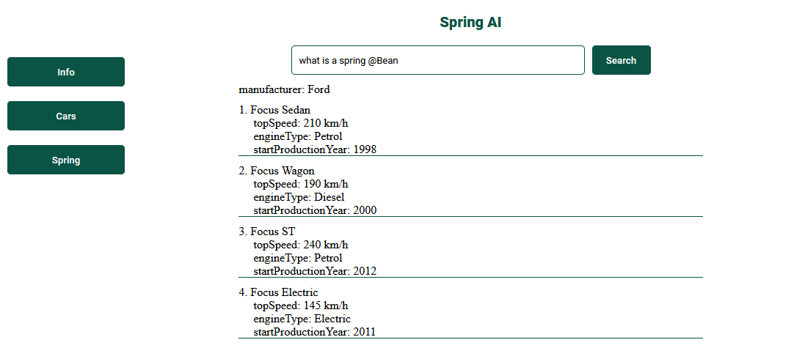
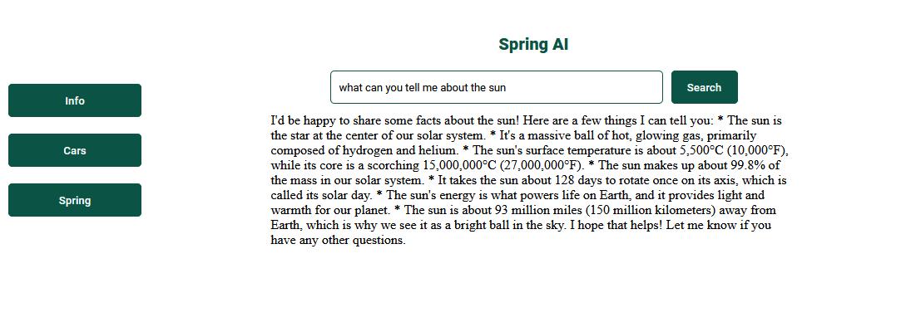
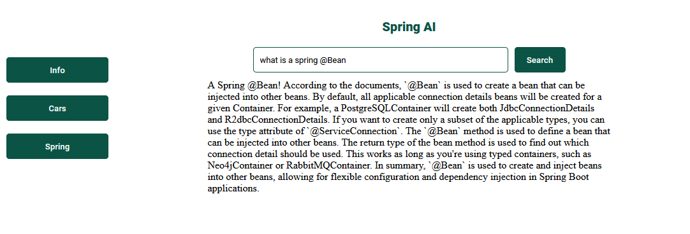

# Ai-Core Service
<hr>
<br>
This is a small service that uses spring-ai and llama3 to save a pdf file in
a pgvector database and answer questions about that pdf file
<br>
The app is constructed using Spring Framework 6 Spring Boot 3.2.5
Angular 18. The entire app is deployed as a single jar, including the Angular 18 part.
The app is using Angular 18 CSR with standalone components. At build time 
the index.html file is created and put in the /resources/browse directory, and at runtime 
the static index.html file generated by Angular 18 is served by the Spring Boot app.

## Stack:
* Spring Framework 6
* Spring boot 3.2.5
* Spring - AI
* Docker
* Kubernetes
* Angular 18

<br>
<hr>

## How to create the entire app:
* create a spring boot project
* inside the root of the spring boot project create the folder and generate an Agular app inside that folder
* in the root folder of the project inside the [build.gradle](build.gradle) file add this code:
    ```
    task deleteStaticFolder(type: Delete){
    def dirName = "src/main/resources/static"
    file( dirName ).list().each{
        f ->
            delete "${dirName}/${f}"
        }
    }
  
    processResources.dependsOn('angular-client-CSR:build')
  ```
* in the root of the angular project add this [build.gradle](angular-client-CSR%2Fbuild.gradle) file

* in the root folder of the project in the [settings.gradle](settings.gradle) file add this line of code:
```
    include 'angular-client-CSR'
```
* the line above is needed so when we build the project it will take into account the angular project and will build that project too
* since this is a Angular CSR nd the html pages are static we need to create a @Controller class so that all paths from the
  browser will be redirected to the index.html page. This class is [PageController.java](src%2Fmain%2Fjava%2Fcom%2Fgini%2Fcontroller%2FPageController.java)


## How to start the app on local:
* run the docker-compose file to create the database: [docker-compose.yml](docker-compose.yml) 
```
  version: '3.8'

  services:
    pgvector:
    image: ankane/pgvector:latest
    container_name: pgvector
    environment:
      - POSTGRES_DB=vectordb
      - POSTGRES_USER=ginitoru
      - POSTGRES_PASSWORD=1234
    volumes:
      - ./init.sql:/docker-entrypoint-initdb.d/init.sql
    ports:
      - '5432:5432' 
 ```
* run the app and connect to: http://localhost:8080/main/info

<hr>

### The app has three topics:
* general questions (Info)
* cars info (Cars)
* spring (Spring) using RAG concept
<br>
<br>

## Generate docker image to deploy to k8s:
1. ```./gradlew clean build``` - builds the jar file
2. ```docker build -t <image_name>:1 . ``` generates the docker image localy
3. ```docker push <image_name>:1``` pushes the image on https://hub.docker.com/
4. ```kubctl apply -f=k8s-pgvector.yaml``` run this command from the root directory to deploy the pgvector database in minikube
5. ````kubectl apply-f=k8s-ai-core.yaml```` run this command from the root directory to deploy the app in minikube
6. Replace the docker image from the k8s-ai-core.yaml file with your own.
<br>




